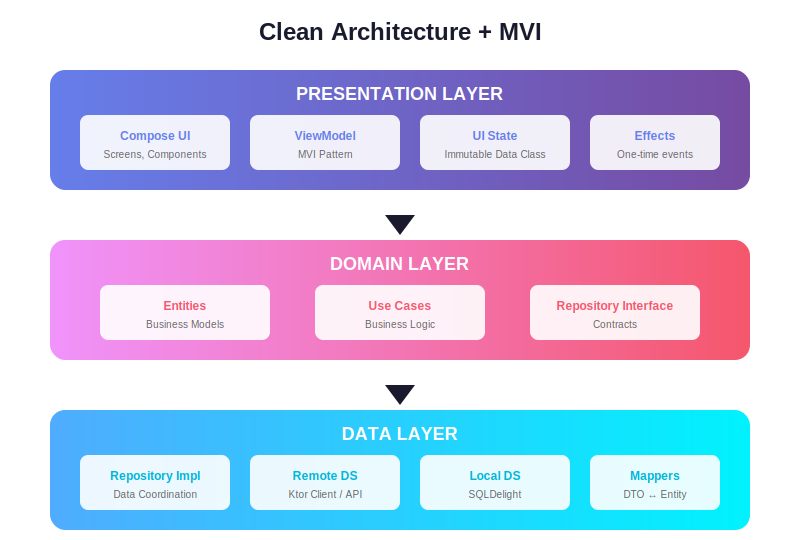
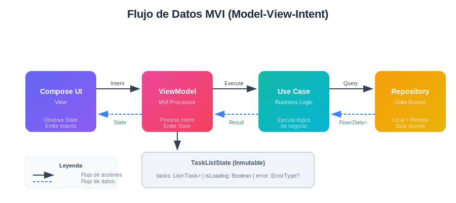
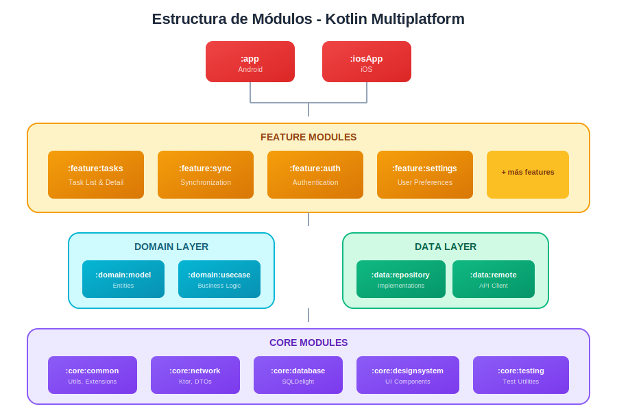
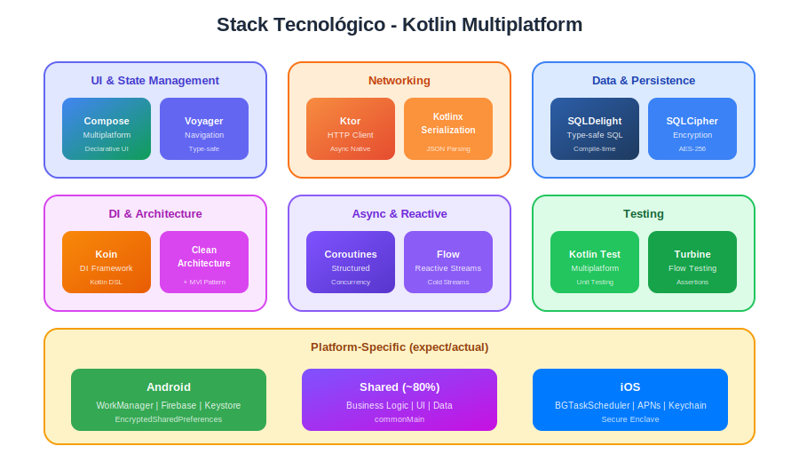
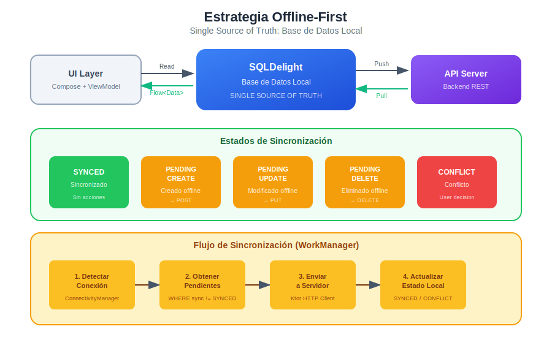

# Documento de Arquitectura
## Aplicación de Gestión de Tareas para Equipos Distribuidos

---

### Resumen Ejecutivo

Este documento describe la arquitectura técnica para una aplicación móvil multiplataforma de gestión de tareas y notificaciones para equipos distribuidos. La solución está diseñada para soportar más de 100,000 usuarios con capacidades offline-first y sincronización automática.

---

## 1. Arquitectura

### 1.1 Arquitectura Elegida: Clean Architecture + MVI

Se implementa **Clean Architecture** combinada con el patrón **MVI (Model-View-Intent)** para la capa de presentación.



#### Justificación de la Elección

| Aspecto | Beneficio |
|---------|-----------|
| **Testabilidad** | Cada capa puede testearse de forma aislada con mocks |
| **Independencia de frameworks** | El dominio no conoce Android, iOS ni bibliotecas externas |
| **Escalabilidad del equipo** | 4-6 desarrolladores pueden trabajar en paralelo sin conflictos |
| **Mantenibilidad** | Cambios en UI no afectan lógica de negocio y viceversa |
| **MVI** | Estado predecible y unidireccional, facilita debugging |

### 1.2 Flujo de Datos MVI

El patrón MVI garantiza un flujo unidireccional de datos, haciendo el estado completamente predecible y fácil de debuggear.



#### Componentes del Estado

| Componente | Tipo | Descripción |
|------------|------|-------------|
| `State` | Data Class Inmutable | Representa el estado actual de la UI |
| `Intent` | Sealed Interface | Acciones que el usuario puede realizar |
| `Effect` | Sealed Interface | Eventos únicos (navegación, snackbars) |

```kotlin
data class TaskListState(
    val tasks: List<Task> = emptyList(),
    val isLoading: Boolean = false,
    val error: ErrorType? = null,
    val syncStatus: SyncStatus = SyncStatus.Idle
)

sealed interface TaskListIntent {
    data object LoadTasks : TaskListIntent
    data class ToggleComplete(val taskId: String) : TaskListIntent
    data object RefreshFromNetwork : TaskListIntent
}
```

### 1.3 Separación de Módulos y Responsabilidades

La modularización permite builds incrementales, ownership claro y escalabilidad del equipo.



#### Módulos de Infraestructura

| Módulo | Descripción |
|--------|-------------|
| `:app` | Punto de entrada Android |
| `:iosApp` | Punto de entrada iOS |
| `:core:common` | Utilidades compartidas, extensiones |
| `:core:network` | Cliente HTTP, interceptores, DTOs |
| `:core:database` | SQLDelight, DAOs, entidades locales |
| `:core:designsystem` | Componentes UI reutilizables |

#### Módulos de Features

| Módulo | Descripción |
|--------|-------------|
| `:feature:tasks` | Lista y detalle de tareas |
| `:feature:sync` | Lógica de sincronización |
| `:feature:auth` | Autenticación y sesión |

---

## 2. Decisiones Tecnológicas

### 2.1 Stack Tecnológico

Se eligió **Kotlin Multiplatform (KMP)** con **Compose Multiplatform** para maximizar la reutilización de código manteniendo performance nativo.



### 2.2 Comparativa de Opciones

| Criterio | Nativo Puro | Flutter | React Native | KMP |
|----------|-------------|---------|--------------|-----|
| Reutilización de código | 0% | ~95% | ~90% | **~80%** |
| Performance | Óptimo | Cercano | Medio | **Óptimo** |
| Acceso a APIs nativas | Total | Limitado | Limitado | **Total** |
| Curva de aprendizaje | Alta (2 stacks) | Media | Media | **Media** |
| Tamaño del equipo requerido | 6-8 devs | 4-6 devs | 4-6 devs | **4-6 devs** |
| Mantenimiento largo plazo | Alto | Medio | Medio-Alto | **Bajo** |

### 2.3 Justificación de KMP

| Razón | Explicación |
|-------|-------------|
| **Equipo unificado** | Un equipo de 4-6 devs puede mantener una sola base de código |
| **Performance nativo** | Compila a código nativo en ambas plataformas |
| **UI compartida** | Compose Multiplatform permite compartir 80%+ de la UI |
| **Flexibilidad** | Posibilidad de implementaciones nativas cuando sea necesario |
| **Ecosistema Kotlin** | Aprovecha coroutines, Flow, y bibliotecas maduras |

### 2.4 Stack Tecnológico Completo

| Capa | Tecnología | Justificación |
|------|------------|---------------|
| **UI** | Compose Multiplatform | Declarativo, compartido iOS/Android |
| **Navegación** | Voyager | Multiplataforma, type-safe, simple |
| **Networking** | Ktor Client | Nativo KMP, soporte coroutines |
| **Persistencia** | SQLDelight | SQL compilado, type-safe, multiplataforma |
| **DI** | Koin | Ligero, DSL Kotlin, KMP nativo |
| **Async** | Kotlin Coroutines + Flow | Estándar en Kotlin, programación reactiva |
| **Serialización** | Kotlinx.serialization | Integración nativa con Ktor |
| **Testing** | Kotlin Test + Turbine | Testing de Flows simplificado |
| **Push Notifications** | Firebase (Android) / APNs (iOS) | Estándar de la industria |

---

## 3. Escalabilidad y Mantenibilidad

### 3.1 Estrategia de Caché Multinivel

| Nivel | Tecnología | Tiempo de Vida | Uso |
|-------|------------|----------------|-----|
| **Memoria** | In-memory cache | Duración de sesión | Datos frecuentes, respuesta inmediata |
| **Disco** | SQLDelight | Persistente | Fuente de verdad local |
| **Red** | Ktor + API | N/A | Sincronización y datos frescos |

### 3.2 Manejo de Entornos

| Ambiente | Base URL | Logging | Analytics | Certificate Pinning |
|----------|----------|---------|-----------|---------------------|
| **DEV** | `api.dev.taskapp.com` | Habilitado | Deshabilitado | Deshabilitado |
| **STAGING** | `api.staging.taskapp.com` | Habilitado | Habilitado | Habilitado |
| **PROD** | `api.taskapp.com` | Deshabilitado | Habilitado | Habilitado |

### 3.3 Build Variants

| Variante | Ambiente | Debuggable | Minificación |
|----------|----------|------------|--------------|
| `debug` | DEV | Sí | No |
| `staging` | STAGING | Sí | Sí |
| `release` | PROD | No | Sí |

### 3.4 Beneficios de la Modularización

| Beneficio | Descripción |
|-----------|-------------|
| **Build times** | Compilación incremental, solo recompila módulos modificados |
| **Ownership** | Cada desarrollador puede ser owner de un feature |
| **Testing** | Tests aislados por módulo |
| **Escalabilidad** | Nuevos features no afectan módulos existentes |

---

## 4. Estrategia Offline-First

### 4.1 Principio Fundamental

> **La base de datos local (SQLDelight) es la única fuente de verdad (Single Source of Truth).**



### 4.2 Flujo de Datos Offline-First

| Operación | Online | Offline |
|-----------|--------|---------|
| **Lectura** | Local DB → UI (background: sync con servidor) | Local DB → UI |
| **Escritura** | Local DB → Cola de sync → Servidor | Local DB → Cola de sync (pendiente) |
| **Sincronización** | Automática cada 15 min + al recuperar conexión | Acumulada en cola local |

### 4.3 Estados de Sincronización

| Estado | Descripción | Acción del Sistema |
|--------|-------------|-------------------|
| `SYNCED` | Dato sincronizado con servidor | Ninguna |
| `PENDING_CREATE` | Creado offline, pendiente de subir | Enviar POST al recuperar conexión |
| `PENDING_UPDATE` | Modificado offline | Enviar PUT al recuperar conexión |
| `PENDING_DELETE` | Eliminado offline | Enviar DELETE al recuperar conexión |
| `CONFLICT` | Conflicto detectado | Notificar usuario para resolución |

### 4.4 Resolución de Conflictos

**Estrategia: Last-Write-Wins con timestamps**

| Escenario | Condición | Acción |
|-----------|-----------|--------|
| Servidor más reciente | `serverUpdatedAt > localUpdatedAt` | Aplicar cambios del servidor |
| Local más reciente | `localUpdatedAt > serverUpdatedAt` | Enviar cambios al servidor |
| Edición simultánea | Ambos modificados desde última sync | Marcar como `CONFLICT`, notificar usuario |

### 4.5 Campos de Control en Entidad

```kotlin
@Entity
data class TaskEntity(
    val id: String,
    val title: String,
    val isCompleted: Boolean,
    val localUpdatedAt: Long,
    val serverUpdatedAt: Long?,
    val syncStatus: SyncStatus
)

enum class SyncStatus {
    SYNCED,
    PENDING_CREATE,
    PENDING_UPDATE,
    PENDING_DELETE,
    CONFLICT
}
```

### 4.6 Configuración de WorkManager (Android)

| Parámetro | Valor | Razón |
|-----------|-------|-------|
| **Intervalo** | 15 minutos | Balance entre frescura y batería |
| **Network Constraint** | `CONNECTED` | Solo sincronizar con conexión |
| **Backoff Policy** | Exponential, 1 min inicial | Evitar saturar servidor en errores |
| **Retry Policy** | Hasta 3 intentos | Manejo de errores transitorios |

### 4.7 Manejo de Errores de Sincronización

| Tipo de Error | Acción | Notificación al Usuario |
|---------------|--------|------------------------|
| Sin conexión | Mantener en cola, reintentar después | Badge/indicador de sync pendiente |
| Servidor no disponible | Backoff exponencial | Notificación si persiste > 1 hora |
| Token expirado | Refresh token automático | Redirigir a login si falla refresh |
| Conflicto de datos | Marcar registro, pausar sync de ese item | Dialog de resolución de conflicto |

---

## 5. Seguridad

### 5.1 Estrategia de Autenticación

**Protocolo: OAuth 2.0 + JWT con Refresh Tokens**


### 5.2 Configuración de Tokens

| Token | Duración | Almacenamiento | Uso |
|-------|----------|----------------|-----|
| **Access Token** | 15 minutos | Memoria (runtime) | Autenticación de requests |
| **Refresh Token** | 7 días | Almacenamiento seguro | Renovar access token |

### 5.3 Almacenamiento Seguro por Plataforma

| Plataforma | Tecnología | Datos Protegidos |
|------------|------------|------------------|
| **Android** | EncryptedSharedPreferences + Android Keystore | Tokens, credenciales |
| **iOS** | Keychain Services + Secure Enclave | Tokens, credenciales |
| **Común** | SQLCipher (SQLDelight) | Base de datos completa |

### 5.4 Niveles de Sensibilidad de Datos

| Nivel | Datos | Protección |
|-------|-------|------------|
| **Alto** | Tokens, contraseñas | Keystore/Keychain cifrado |
| **Medio** | Datos de usuario, tareas | SQLCipher (AES-256) |
| **Bajo** | Preferencias de UI | SharedPreferences/UserDefaults |

### 5.5 Medidas de Seguridad en Red

| Medida | Implementación | Propósito |
|--------|----------------|-----------|
| **HTTPS obligatorio** | Configuración de Ktor | Cifrado en tránsito |
| **Certificate Pinning** | SHA-256 del certificado | Prevenir MITM attacks |
| **Request Signing** | HMAC-SHA256 | Integridad de requests sensibles |
| **Rate Limiting** | Client-side throttling | Prevenir abuso/bloqueo |

### 5.6 Headers de Seguridad en Requests

| Header | Valor | Propósito |
|--------|-------|-----------|
| `Authorization` | `Bearer {token}` | Autenticación |
| `X-Platform` | `android` / `ios` | Identificar plataforma |
| `X-App-Version` | `1.0.0` | Control de versiones |
| `X-Request-ID` | UUID único | Trazabilidad |
| `X-Device-ID` | ID único del dispositivo | Detección de anomalías |

### 5.7 Mejores Prácticas Adicionales

| Práctica | Descripción |
|----------|-------------|
| **No hardcodear secrets** | Usar BuildConfig o variables de entorno |
| **Ofuscación de código** | ProGuard/R8 en Android |
| **Validación de inputs** | Sanitizar antes de enviar al servidor |
| **Logging seguro** | Nunca loggear tokens o datos sensibles |
| **Detección de root/jailbreak** | Advertir al usuario, limitar funcionalidad sensible |

---

## Conclusión

Esta arquitectura proporciona:

| Objetivo | Solución |
|----------|----------|
| **Escalabilidad 100k+ usuarios** | Caché multinivel, sincronización optimizada, arquitectura stateless |
| **Mantenibilidad** | Clean Architecture, modularización por features, código compartido |
| **Experiencia offline robusta** | Offline-first con SQLDelight, cola de sincronización, resolución de conflictos |
| **Seguridad enterprise** | OAuth 2.0, cifrado en reposo y tránsito, certificate pinning |
| **Productividad del equipo** | KMP reduce duplicación, un solo codebase, CI/CD unificado |

---

*Documento preparado como parte del Challenge Mobile Tech Lead*
